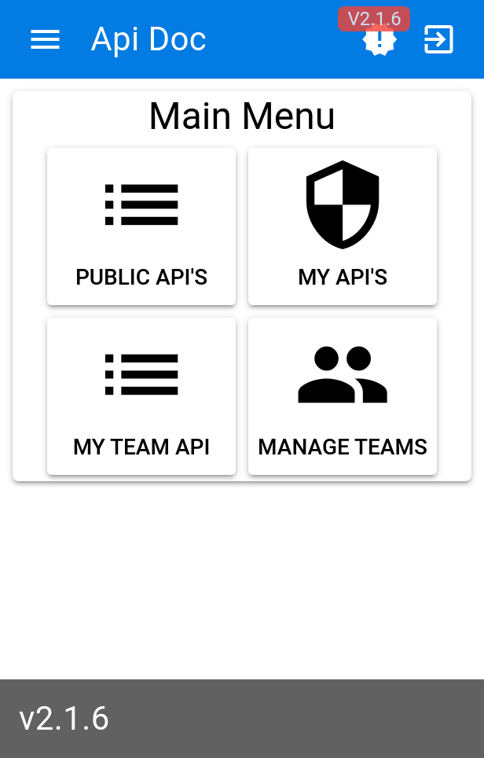
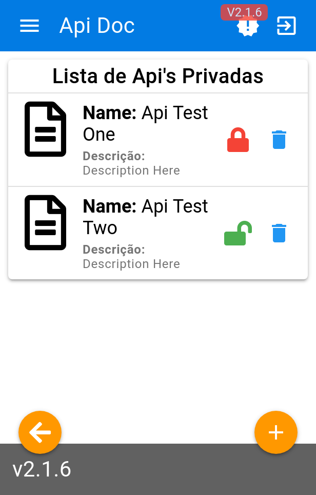

  

# Api Doc

Main Menu             |  List Api          |Paths
:-----------------------:|:-------------------------:|:-----------------------:
      |     | 

### Features

- [x] Login and Register
- [x] Team System
- [x] Api Private
- [x] Api Public
- [x] Api In Team
- [x] Tags
- [x] Paths
- [x] Responses
- [x] Test Request
- [x] Post
- [x] Get
- [x] Delete
- [x] Put
- [x] Send Headers on test
- [x] Send Body on test
- [x] Send Params on test
- [ ] Send DataForm on test

> Api doc is a CRUD api documenter, this system is part of my personal portfolio, but it was born out of a need to document my APIs and test it on one platform, any resemblance to swagger, insomnia or postman is not a conscience, I love it these applications and I was inspired by them to do the research needed to build "Api Doc"


### About NPM Libs

Some dependencies I would like to leave the reference and thanks

[Express](https://github.com/expressjs/express),
[Knex](https://github.com/knex/knex),
[Knex](https://github.com/knex/knex),
[Axios](https://github.com/axios/axios),
[Quasar Framework](https://github.com/quasarframework/quasar),
[vue-json-edit](https://github.com/jinkin1995/vue-json-edit),
[vue-json-pretty](https://leezng.github.io/vue-json-pretty),

### The Environment
> There are 2 environments in the project, one for API and one for View.
```shell
# for create .env files
$ cp .env.example .env
$ cd view && .env.example .env

# the .env api
HTTPSERVERPORT # port view, ex.: 80
APIPORT # port api, ex.:8080
PORTDB # port database, ex.: 5432

# database postgres or mysql settings
HOSTDB # ip for host database "external" ex.: 168.168.168.16 
POSTGRES_USER=admin # user database, default is admin or postgres
POSTGRES_PASSWORD # password database
POSTGRES_DB # database name

NODE_ENV # mode system: dev or prod
DOMAIN # the name your domain, ex.: example.com

# setting for your smtp, to recovery password user and etc.
HOSTSMTP=smtp.gmail.com
PORTSMTP=587
EMAIL=@gmail.com
PASSSWORDSMTP=123

SECRET # the key for your api


# the .env view
APIURL # path to api, ex.: https://example.com:8080
VERSION # For Show Version in Footer and Header frontend
```
### The Database
> In development, the database used was postgres, however, knex supports sqlite3 and mysql as well, probably mysql will work well in production, as sqlite3 is not advisable to use it in development or production, as knex's "returning" function doesn't work. it works on it and it is in this project.

### How to Install
```shell
# Production with Docker

$ chmod 777 install.sh
$ ./install.sh

# Development without Docker
$ yarn install
$ cd view && yarn install
# or
$ npm run install
$ cd view && npm run install
```

### How to Build
```shell
# Production with Docker

$ chmod 777 build.sh
$ ./build.sh

# Development without Docker
$ yarn build
$ yarn build:view
# or
$ npm run build
$ npm run build:view
```

### How to Serve
```shell
# Production with Docker

$ docker-compose up -d

# Development without Docker
$ yarn dev
$ cd view && yarn dev
# or
$ npm run dev
$ cd view && npm run dev
```

### How to Migrate
```shell
# Production with Docker
# needed "docker-compose up -d pg" first, for up database
$ chmod 777 migrate.sh
$ ./migrate.sh

# Development without Docker
# for up
$ yarn migrate
# or
$ npm run migrate

# for down
$ yarn migratedown
# or
$ npm run migratedown
```

## License

  [MIT](LICENSE)